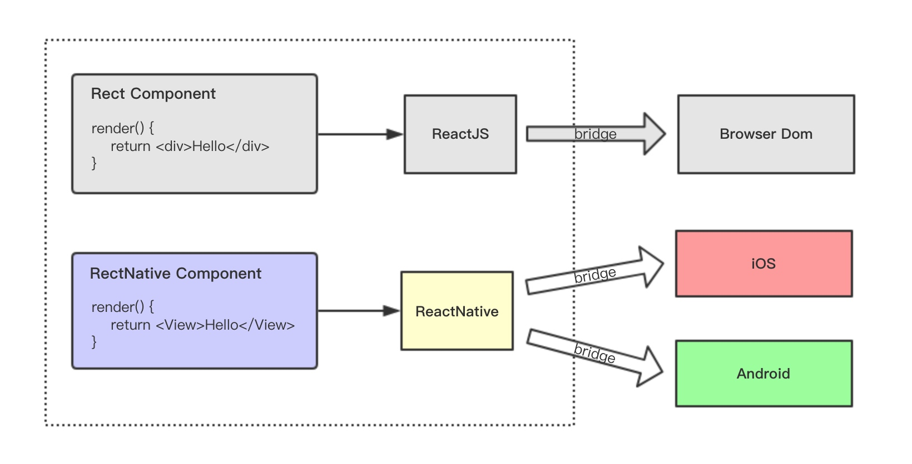

# ReactNative Tutorial

## Getting Started

### Environment

1.**nodejs**

```shell
brew install node
```

2.**npm4**  [why not npm5?](https://github.com/facebook/react-native/issues/14767)

```shell
npm install -g npm@4
```

3.**yarn**

```shell
brew install yarn
```

4.**watchman**

```shell
brew install watchman
```

[watchman permission](https://stackoverflow.com/questions/16432071/how-to-fix-homebrew-permissions/16450503) : `sudo chown -R $(whoami) $(brew --prefix)/*`

5.**react-native-cli**  or  ~~create-react-native-app~~

```shell
npm install -g react-native-cli
```

### Run it

```shell
react-native init ReactNativeTutorial
```
``` shell
react-native run-ios
react-native run-android
```

**Android issue**

- ./android/gradle/wrapper/gradle-wrapper.properties
- ./android/build.gradle
- ./android/app/build.gradle
- ./android/local.properties
- touch ~/.gradle/gradle.properties && echo "org.gradle.daemon=true" >> ~/.gradle/gradle.properties

**iOS issue**

- [xcrun: error](https://stackoverflow.com/questions/39778607/error-running-react-native-app-from-terminal-ios) :  _Xcode/Setting/Location_ -> Command Line Tools

### Developer Menu

### How it works 




## ES6 标准

[参考-1](http://es6.ruanyifeng.com/)
[参考-2](http://blog.kdchang.cc/2016/04/04/react-react-native-es5-es6-cheat-sheet)

 **Modules**

```javascript
import React from 'react';
import MyComponent from './MyComponent';
import {parseData} from './xxx';
import * as APIs from '../constants/ServerAPIs';

export default class MyComponent extends Compoent {
	
}

export function parseData() {
}
```

**Classes & Method**

```javascript
class Photo extends React.Component {
  handleClick(event) {
  }
  render() {
  }
}
```

**Property initializers**

```javascript
class Todo extends React.Component {
    render() {
        return (
            <Text>Hello</Text>
        );
    }
}
Todo.defaultProps = {
    checked: false,
    maxLength: 10,
};
Todo.propTypes = {
    checked: React.PropTypes.bool.isRequired,
    maxLength: React.PropTypes.number.isRequired,
};
```

**State**

```javascript
class Todo extends React.Component {
    state = {
        maxLength: this.props.maxLength,
    }
}

class Todo extends React.Component {
    constructor(props){
        super(props);
        this.state = {
            maxLength: this.props.maxLength,
        };
    }
}
```

**Arrow functions**

```javascript

class Todo extends React.Component {
    render(){
        return <TouchableOpacity onPress={() => console.log("Arrow function called") }}/>
    }
}
```

**Dynamic property names & template strings**

```javascript
const name = "Bob", time = "today";
let msg = `Hello ${name}, how are you ${time}?`

const stateName = "toggle"
this.setState({ [`${stateName}Value`]: true });
```

**Destructuring & spread attributes**

```javascript
class Todo extends React.Component {
  render() {
    var {
      className,
      ...others,  // ...others 包含 this.props 除了 className 外所有值。this.props = {value: 'true', title: 'header', className: 'content'}
    } = this.props;
    return (
      <div className={className}>
        <TodoList {...others} />
        <button onClick={this.handleLoadMoreClick}>Load more</button>
      </div>
    );
  }
}
```

**Default Parameters**

```javascript
function test(height = 50, color = 'red') {  
  ...  
}
```

## Component

```javascript
class CustomComponent extends Component {
}
```

### JSX

```javascript
class CustomComponent extends Component {
    render() {  
        <View>
          <Text>This is a title!</Text>
          <View>
            <Text>This is a Summary</Text>
          </View>
        </View>
    }
}
```

### props & state

```javascript

// 父组件
class ParentComponent extends Component{
    constructor(props) {
        super(props)
        this.state = {
            childName = "子组件"
        }
    }

    render(){
        return(
            <ChildComponent name={this.state.childName}>
        )
    }
}

// 子组件
class ChildComponent extends Component{
    render(){
        return(
            <Text>{this.props.name}</Text>
        )
    }
}
```

### Lifecycle


```
// 组件开始装载之前调用，在一次生命周期中只会执行一次。
componentWillMount()
``` 

```
// 组件完成装载之后调用，在一次生命周期中只会执行一次，从这里开始就可以对组件进行各种操作了，比如在组件装载完成后要显示的时候执行动画。
componentDidMount()
```

```
// 组件属性更新之前调用，每一次属性更新都会调用
componentWillUpdate(object nextProps, object nextState)
```

```
// 组件属性更新之后调用，每次属性更新都会调用
componentDidUpdate(object prevProps, object prevState)
```

```
// 组件卸载之前调用
componentWillUnmount()
```

### Style & FlexBox


## 组件使用

### Image

**本地图片**

```javascript
<Image source={require('./assets/email.png')}/>
```

Packager 会打包所有的图片并且依据屏幕精度提供对应的资源。比如: **iPhone 6** 会使用 email@2x.png，而 **Pixel** 上则会使用 email@3x.png。如果没有图片恰好满足屏幕分辨率，则会自动选中最接近的一个图片。


**网络图片**

```javascript
<Image source={{ uri: 'https//assets.domain/xxx.jpg'}}
```

[ATS issue](https://segmentfault.com/a/1190000002933776)


### ListView


```javascripts
<ListView
    dataSource={...}
    renderRow={...}
/>
```

### Animation

[参考](http://www.alloyteam.com/2016/01/reactnative-animated/)

## Network
React Native 提供了和 web 标准一致的Fetch API

```javascripts

fetch('https://mywebsite.com/endpoint/', {
  method: 'POST',
  headers: {
    'Accept': 'application/json',
    'Content-Type': 'application/json',
  },
  body: JSON.stringify({
    firstParam: 'yourValue',
    secondParam: 'yourOtherValue',
  })
})

```

## AsyncStorage

是一个简单的、异步的、持久化的 **key-value** 存储系统，它对于App来说是全局性的。它用来代替 **LocalStorage**

```javascripts
async saveUserName(account: String) {
    let key = '@key-user-name';
    try {
        await AsyncStorage.setItem(key, account);
    } catch (error) {
        console.warn(error)
    }
};

async getUserName() {
    let key = '@key-user-name';
    try {
        return await AsyncStorage.getItem(key);
    } catch (error) {
        console.warn(error)
    }
    return null;
};
```

## NativeBridge


## 打包

### iOS

1.执行打包命令

```shell
react-native bundle --entry-file index.js --platform ios --dev false --bundle-output release_ios/main.jsbundle --assets-dest release_ios/
```


2.将 **assets** 与 **main.jsbundle** 添加到项目中


3.修改 **AppDelegate.m**，让 React Native 去使用我们刚才导入的 **jsbundle**

```objective-c
- (BOOL)application:(UIApplication *)application didFinishLaunchingWithOptions:(NSDictionary *)launchOptions
{
    
  NSURL *jsCodeLocation;
 //jsCodeLocation = [[RCTBundleURLProvider sharedSettings] jsBundleURLForBundleRoot:@"index.ios" fallbackResource:nil];
 +jsCodeLocation = [[NSBundle mainBundle] URLForResource:@"main" withExtension:@"jsbundle"];
#endif
...
  return YES;
}
```
4.在 [iTunes Connect](https://itunesconnect.apple.com) 创建应用 ➜ 打包程序 ➜ 将应用提交到app store


### Android

[参考](https://developer.android.com/studio/publish/app-signing.html)

1. 生成证书
2. 配置gradle

```groovy
android {      
    signingConfigs {  
        release {  
            storeFile file_dir
            storePassword store_assword
            keyAlias alias
            keyPassword keyp_assword  
        }  
    }  
    buildTypes {  
        release {   
            signingConfig signingConfigs.release  
        }  
    }  
}  
```

3.打包 APK

```shell
./gradlew assembleRelease
```

## 热更新

### codepush

https://microsoft.github.io/code-push/

### 自己实现

[参考1](http://www.lcode.org/react-native-hot-update/)
[参考2](http://www.jianshu.com/p/2cb3eb9604ca)

以 Android 为例

```
react-native bundle --entry-file index.js --platform android --dev false --bundle-output release_android/main.jsbundle --assets-dest release_android/
```

- 1.初始项目发布时，生成并保留一份 **bundle** 文件。
- 2.有版本更新时，生成新的  **bundle** 文件，
- 3.使用 **google-diff-match-patch** 对比两个文件，并生成差异补丁文件。
- 4.App 下载补丁文件，再使用 **google-diff-match-patch** 和 assets 目录下的初始版本合并，生成新的 **bundle** 文件。


